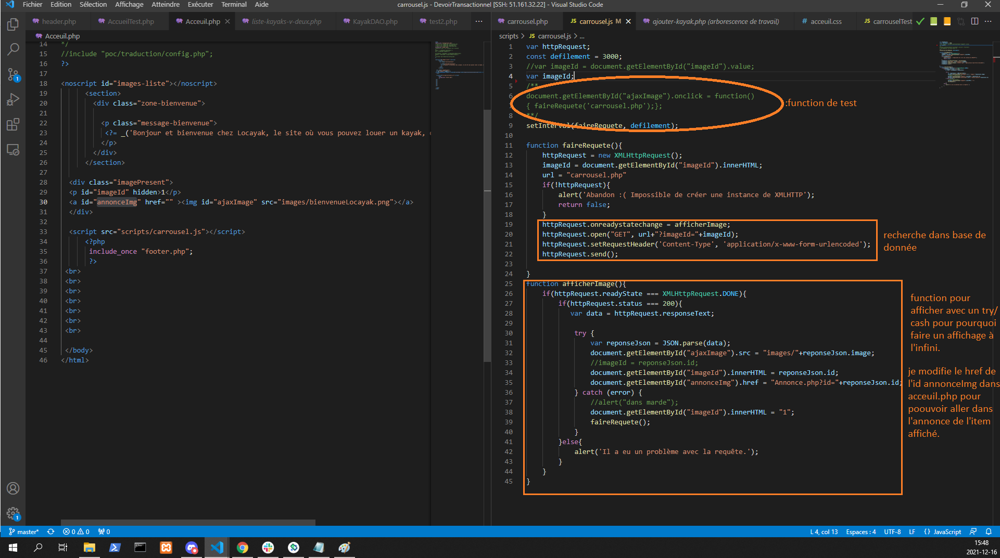
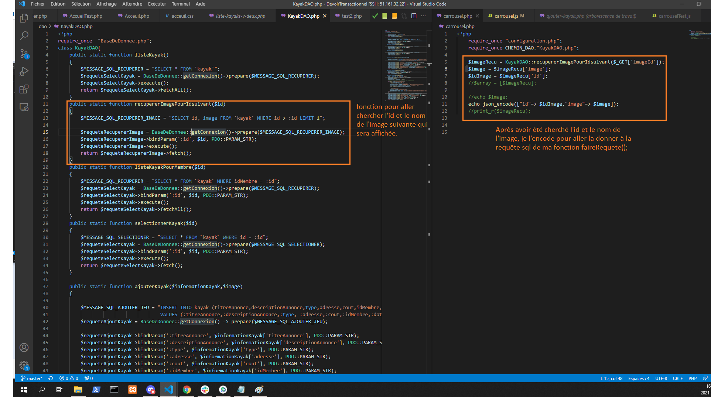

# Projet Ajax avec un Carrousel à image d'Éric Pelletier
 
 

## Il a fallu que j'expérimente mes compétences pour faire des requêtes sql avec la méthode ajax pour afficher une images à la fois et aussi donner l'option à l'utilisateur de pouvoir cliquer sur l'image et ainsi afficher l'annonce du kayak sélectionné.

## J'ai fabriqué une fonction dans le DAO qui fait une requète sql à la base de donnée pour me donner l'id du kayak ainsi que son nom. Ainsi avec ces données que je peux chercher sur le serveur l'image suivante qui sera affiché dans la page acceuil.php et aussi avec le id de l'image, je change le href de la base avec l'id="annonceImg" pour que l'utilisateur puisse aller voir le kayak dans la page annonce.php de ce dernier.

## fiche Ajax https://docs.google.com/document/d/1Ld2zDgHhf9oCxvdCLopyfxYQv2_h6COLrtL59qFp3as/edit#

